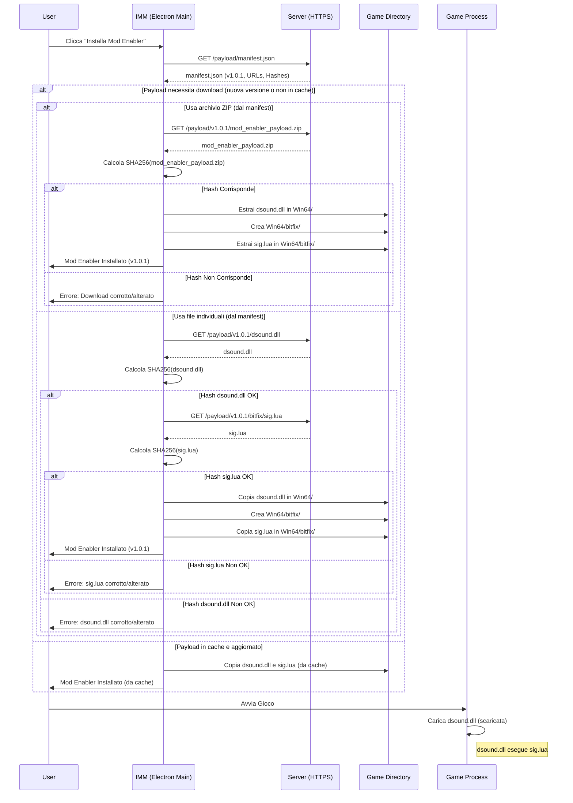

# Soluzione 1: Download-on-Demand (Puro) per `dsound.dll` e `sig.lua`

**Obiettivo Primario**: Minimizzare i falsi positivi antivirus sull'installer dell'IMM e consentire aggiornamenti agili del payload del Mod Enabler.

---

## 1. Architettura Tecnica Dettagliata

**Componenti Coinvolti**:

1.  **IMM (Client - `electron/main/index.ts`)**:
    *   **Nessun Payload Pre-impacchettato**: La directory `electron/resources/mod_enabler_payload/` verrà rimossa o svuotata. L'installer dell'IMM non conterrà più `dsound.dll` né la cartella `bitfix/`.
    *   **Configurazione**:
        *   URL del manifest del payload (es. `https://your-nebula-studios.com/inzoi-mod-manager/payload/manifest.json`).
        *   (Opzionale) Chiave pubblica per la verifica della firma del manifest (se si implementa la firma del manifest).
    *   **Logica di Installazione del Mod Enabler (modifica a `install-mod-enabler` in `electron/main/index.ts`)**:
        1.  **Fetch Manifest**: All'attivazione del Mod Enabler, l'IMM scarica un file `manifest.json` dal server HTTPS specificato.
        2.  **Verifica Manifest (Opzionale ma Raccomandato)**:
            *   Verificare la firma del manifest se implementata.
            *   Controllare la versione del payload nel manifest per eventuale caching.
        3.  **Download Payload**: Il manifest conterrà gli URL per scaricare i file necessari (es. `dsound.dll` e `bitfix/sig.lua`, o un singolo archivio `mod_enabler_payload.zip`) e i loro hash SHA256.
        4.  **Verifica Integrità Payload**: Dopo il download, l'IMM calcola l'hash SHA256 dei file scaricati e li confronta con quelli specificati nel manifest. Se non corrispondono, l'operazione fallisce e l'utente viene notificato.
        5.  **Installazione Locale**:
            *   Se il payload è un archivio ZIP, viene estratto.
            *   I file (`dsound.dll`, `bitfix/sig.lua`, ecc.) vengono copiati nella directory del gioco: `<gamePath>/BlueClient/Binaries/Win64/`. La sottocartella `bitfix/` viene creata se necessario.
        6.  **Caching (Opzionale)**: Il payload scaricato e verificato (o il manifest) può essere messo in cache nell'area dati dell'utente IMM per evitare download ripetuti se la versione non è cambiata.
    *   **Logica di Disinstallazione del Mod Enabler**: Rimuove `dsound.dll` e la cartella `bitfix/` dalla directory del gioco, come avviene attualmente.
    *   **Logica di Verifica Stato (`check-mod-enabler-status`)**: Verifica la presenza dei file nella directory del gioco. Potrebbe essere estesa per verificare la versione del payload installato rispetto al manifest.

2.  **Server HTTPS Esterno**:
    *   Ospita i file del payload del Mod Enabler.
    *   **`manifest.json`**: Un file JSON che descrive il payload corrente. Esempio:
        ```json
        {
          "payloadVersion": "1.0.1", // Versione del payload
          "releaseNotes": "Fixed compatibility with game patch X.Y.Z.",
          "files": [
            {
              "relativePath": "dsound.dll", // Relativo alla directory del payload sul server
              "url": "https://your-server.com/payload/v1.0.1/dsound.dll",
              "sha256": "abcdef123456...",
              "destination": "dsound.dll" // Relativo a Win64/
            },
            {
              "relativePath": "bitfix/sig.lua",
              "url": "https://your-server.com/payload/v1.0.1/bitfix/sig.lua",
              "sha256": "fedcba654321...",
              "destination": "bitfix/sig.lua" // Relativo a Win64/
            }
          ],
          // Alternativa: un singolo archivio ZIP
          "archive": {
            "fileName": "mod_enabler_payload_v1.0.1.zip",
            "url": "https://your-server.com/payload/v1.0.1/mod_enabler_payload_v1.0.1.zip",
            "sha256": "123456abcdef..."
            // L'archivio conterrebbe dsound.dll e bitfix/sig.lua
          }
          // "manifestSignature": "..." // Opzionale: firma del manifest
        }
        ```
    *   **File del Payload**: Le versioni attuali di `dsound.dll` e `bitfix/sig.lua` (e altri eventuali file necessari). Idealmente, la `dsound.dll` ospitata dovrebbe essere firmata digitalmente.

3.  **`dsound.dll` e `sig.lua`**:
    *   Funzionalmente identici alla versione attuale. La `dsound.dll` (scaricata) carica ed esegue `sig.lua` (scaricato) dalla sottocartella `bitfix/` relativa alla sua posizione.

---

## 2. Diagramma di Sequenza (Mermaid)



---

## 3. Vantaggi e Svantaggi

*   **Vantaggi**:
    *   **Installer IMM Estremamente Pulito**: Massima riduzione dei falsi positivi sull'installer dell'IMM.
    *   **Aggiornamenti Centralizzati e Agili del Payload**: Modifiche a `dsound.dll` o `sig.lua` (es. per nuove patch del gioco o bypass) possono essere distribuite rapidamente aggiornando i file sul server, senza richiedere un aggiornamento completo dell'IMM.
    *   **Dimensione Ridotta dell'Installer IMM**: Anche se marginale, l'installer sarà più leggero.
    *   **Payload Sempre Aggiornato**: Gli utenti ricevono l'ultima versione del payload all'installazione (o tramite meccanismo di aggiornamento basato su manifest).
    *   **Trasparenza**: Il manifest può includere note di rilascio per le versioni del payload.

*   **Svantaggi**:
    *   **Dipendenza da Internet**: L'installazione/aggiornamento del Mod Enabler richiede una connessione a Internet. Se l'utente è offline, non può installare/aggiornare il payload (a meno che non sia in cache e valido).
    *   **Dipendenza e Costi del Server**: Richiede un server HTTPS affidabile per ospitare il manifest e i file del payload. Implica costi di hosting e manutenzione. Se il server è irraggiungibile, la funzionalità è compromessa.
    *   **Potenziale Scrutinio Antivirus al Runtime**: Il download e la scrittura di una DLL e di script nella directory di un gioco possono ancora attivare HIPS (Host Intrusion Prevention Systems) o AV comportamentali aggressivi, sebbene generalmente meno problematico di un installer flaggato.
    *   **Ritardo Iniziale**: La prima installazione del Mod Enabler sarà più lenta a causa del download.
    *   **Sicurezza del Server Critica**: Il server diventa un punto nevralgico. Se compromesso, potrebbe distribuire payload malevoli. La sicurezza del server e l'uso di HTTPS sono fondamentali.

---

## 4. Impatto su Sicurezza e Rilevazione Antivirus

*   **Impatto Antivirus**:
    *   **Installer IMM**: Drasticamente positivo. L'assenza di `dsound.dll` dovrebbe eliminare la maggior parte dei falsi positivi sull'installer.
    *   **Runtime**: Il momento critico si sposta al download e alla scrittura dei file.
        *   L'uso di HTTPS è mandatorio.
        *   La firma digitale della `dsound.dll` ospitata sul server è altamente raccomandata.
        *   La reputazione del dominio del server si costruirà nel tempo.
        *   Gli utenti con AV molto restrittivi potrebbero ancora necessitare di aggiungere esclusioni per la directory del gioco o per i file scaricati, come indicato in `ANTIVIRUS_EXCLUSIONS.md`.
*   **Considerazioni sulla Sicurezza**:
    *   **Server Sicuro**: Protezione robusta contro accessi non autorizzati e modifiche ai file ospitati.
    *   **HTTPS**: Previene attacchi Man-in-the-Middle durante il download.
    *   **Integrità del Payload**: Verifica client-side tramite hash SHA256 (dal manifest) è cruciale.
    *   **Firma del Manifest (Opzionale Avanzato)**: Firmare il `manifest.json` con una chiave privata e verificarlo sull'IMM con una chiave pubblica pre-impacchettata aggiungerebbe un ulteriore livello di sicurezza contro la manomissione del manifest.
    *   **Origine del Payload**: Assicurarsi che `dsound.dll` e `sig.lua` provengano da fonti fidate e siano stati verificati prima di essere ospitati.

---

## 5. Complessità di Implementazione

*   **Client-Side (IMM - `electron/main/index.ts`)**: **Media-Alta**
    *   Logica di download (usando `net` di Electron o librerie come `node-fetch`).
    *   Calcolo hash (modulo `crypto` di Node.js).
    *   Estrazione ZIP (es. `adm-zip`) se si usa un archivio.
    *   Gestione robusta degli errori (rete, hash, file system).
    *   Parsing del manifest JSON.
    *   (Opzionale) Logica di caching e gestione versioni.
*   **Server-Side**: **Bassa-Media**
    *   Configurazione di un server statico HTTPS (es. GitHub Pages se i file sono pubblici e di dimensioni contenute, bucket S3/GCS con CloudFront/CDN, o un semplice server Node/Python/Nginx).
    *   Processo per aggiornare i file del payload, il manifest (inclusi nuovi hash e versioni) sul server.
*   **Sviluppo `dsound.dll` / `sig.lua`**: Nessuna modifica richiesta alla loro logica interna, solo al metodo di distribuzione.

---

## 6. Compatibilità con il Sistema Esistente

*   **`electron/main/index.ts`**:
    *   La funzione `install-mod-enabler` (attualmente alle righe 962-1068) necessiterà di una riscrittura completa per implementare il flusso di download, verifica ed estrazione.
    *   I percorsi `sourceDsoundPath` e `sourceBitfixFolderPath` (righe 1009-1018) non saranno più rilevanti in quanto i file non sono più locali.
    *   La funzione `check-mod-enabler-status` (righe 321-390) rimarrà concettualmente simile, ma potrebbe essere arricchita per controllare la versione del payload.
*   **`sig.lua` (`electron/resources/mod_enabler_payload/bitfix/sig.lua`)**: Nessuna modifica richiesta.
*   **`dsound.dll` (originale, ora da ospitare)**: Nessuna modifica funzionale richiesta. Deve ancora caricare Lua ed eseguire `sig.lua` da una sottocartella `bitfix/` relativa.

---

## 7. Esperienza Utente (UX)

*   **Positiva**:
    *   Installazione dell'IMM più fluida, con meno (o nessuna) interruzione da parte degli antivirus.
    *   Il payload del Mod Enabler si aggiorna automaticamente all'ultima versione disponibile sul server senza che l'utente debba aggiornare l'IMM.
*   **Negativa**:
    *   Necessità di connessione Internet per la prima installazione del Mod Enabler o per i suoi aggiornamenti.
    *   Leggero ritardo durante il download iniziale del payload.
    *   Possibilità di errori se il server non è raggiungibile o se la connessione è instabile. Una messaggistica chiara è fondamentale.
    *   Potenziali (ma si spera ridotti) avvisi AV al runtime.

---

## 8. Considerazioni Aggiuntive

*   **Aggiornamenti del Payload**:
    *   Gestiti interamente sul server aggiornando i file e il `manifest.json`.
    *   L'IMM può confrontare la versione del payload nel manifest con una versione locale (se in cache) per decidere se scaricare nuovamente.
*   **Integrità dei File**:
    *   **HTTPS**: Protegge i dati in transito.
    *   **Hashing SHA256**: Verifica l'integrità dei file scaricati rispetto a quanto dichiarato nel manifest.
*   **Performance**:
    *   Nessun impatto significativo sulle performance generali dell'IMM o del gioco una volta che il payload è installato. L'unico impatto è il tempo di download iniziale.
*   **Compatibilità Cross-Platform**:
    *   Il meccanismo di download è cross-platform. Tuttavia, `dsound.dll` è specifico per Windows, quindi il Mod Enabler rimane una funzionalità solo per Windows.

---

## 9. Raccomandazione Finale per l'Implementazione

Questa soluzione (Download-on-Demand puro) è una scelta valida per l'obiettivo di pulizia dell'installer.

**Passi Chiave per l'Implementazione**:

1.  **Definire Struttura Manifest**: Finalizzare i campi del `manifest.json` (si consiglia l'approccio con archivio ZIP per semplicità di gestione di più file).
2.  **Preparare Payload Iniziale**:
    *   Prendere l'attuale `dsound.dll` e la cartella `bitfix/` (con `sig.lua`).
    *   (ALTAMENTE RACCOMANDATO) Firmare digitalmente `dsound.dll` con un certificato di code signing.
    *   Creare l'archivio `mod_enabler_payload.zip` contenente questi file.
    *   Calcolare l'hash SHA256 dello ZIP.
3.  **Configurare Server HTTPS**:
    *   Scegliere una piattaforma di hosting (es. GitHub Releases è una buona opzione gratuita per file pubblici).
    *   Caricare lo ZIP del payload e il `manifest.json` (contenente l'URL corretto dello ZIP e il suo hash).
4.  **Sviluppo Client IMM (`electron/main/index.ts`)**:
    *   Rimuovere la cartella `electron/resources/mod_enabler_payload/`.
    *   Riscrivere la logica di `install-mod-enabler`:
        *   Fetch del `manifest.json`.
        *   Download dello ZIP del payload.
        *   Verifica dell'hash dello ZIP.
        *   Estrazione dello ZIP nella directory corretta del gioco (`<gamePath>/BlueClient/Binaries/Win64/`, creando `bitfix/`).
        *   Implementare una gestione degli errori chiara e informativa per l'utente.
    *   Implementare una logica di caching di base per il payload (es. salvare lo ZIP scaricato in `app.getPath('userData')/payload_cache/` e riutilizzarlo se la versione nel manifest non è cambiata).
5.  **Test Rigorosi**:
    *   Testare il flusso di installazione/disinstallazione del Mod Enabler in vari scenari (online, offline con cache, server non raggiungibile, hash non corrispondente).
    *   Testare su VirusTotal e con diversi AV per valutare l'impatto sui falsi positivi (sia dell'installer IMM che del comportamento al runtime).
6.  **Documentazione**: Aggiornare `ANTIVIRUS_EXCLUSIONS.md` e la documentazione utente per riflettere il nuovo comportamento e i potenziali avvisi AV al runtime.